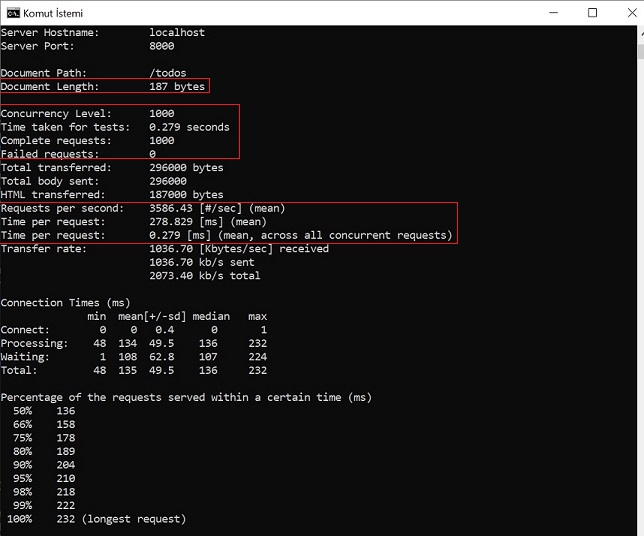

# TODO API

RESTful API (using JSON) to create, read, update and delete TODO items.

## Getting Started
I used the GO programming language in this project, although I haven't used it before. Because, in terms of API development, GO offers many advantages over other programming languages. For example, concurrency model in Golang ensures faster performance than other programming languages.

First of all i planned to implement todo api with Java without a full framework, searched some micro frameworks like Spark and Rapidoid. In Java i was planning to use thread pool to serve concurrent requests with producer consumer approach. But finally i decided to use GO language because it s easy to learn, simple, static typing, easy concurrency model(lightweight fast go routines), nice standard library for web api (json, web server etc.) 

### Prerequisites

* [Go] (https://golang.org/dl/) - Downloading Go programming language is needed
* [mux] (https://github.com/gorilla/mux/blob/master/README.md) - mux is used for router. It can be downloaded with this command

```
go get -u github.com/gorilla/mux
```
Gorilla mux is just a multiplexer. All it does is map routes (and dispatch them) to handlers. It still uses http.ListenAndServe (since you register the mux with net/http) which starts a new goroutine on every request serve concurrently. 


### Run

```
go build todoapi.go
./todoapi

or

go run todoapi.go
```

## Requests

### Create TODO

```
/todos POST action

Example of JSON

 {
    "title": "Buying books",
    "description": "Getting document for exam",
    "tags": ["School", "Exam"],
    "date": "2019-07-15T00:00:00Z"
}
```

### Get All TODOs

```
/todos GET action

Example of result

 {
    "id": "9566c74d-1003-7c4d-7bbb-0407d1e2c649",
    "title": "Buying books",
    "description": "Getting document for exam",
    "tags": [
        "School",
        "Exam"
    ],
    "date": "2019-07-15T00:00:00Z",
    "completed": false
}
```

### Get TODO According to Title

```
/todos/title/{title} GET action
```

### Get TODO According to Description

```
/todos/description/{description} GET action
```

### Get TODO According to Tags

```
/todos/tag/{tag} GET action
```

### Get TODO According to DueDate

```
/todos/duedate/{date} GET action
```

### Delete TODO

```
/todos/{id} DELETE action
```

### Update TODO

```
/todos/{id} PUT action
```
### Delete All TODOS

```
/todos DELETE action
```

### Generate thousands of fake to-do items


ApacheBench was used for this purpose. Command for generating thousands of fake to-do items is below :

```
ab -p todoitem.txt -T application/json -c 1 -n 1000 http://localhost:8000/todos

```


## Benchmark Results
ApacheBench was used for this test. Command for benchmark test is below :

```
ab -p todoitem.txt -T application/json -c 1000 -n 1000 http://localhost:8000/todos
```
-c means number of concurent request, -n means number of total requests and -p means POST request.

### Results of Benchmark



1000 requests were made concurrently. Time taken for tests was 0.279 seconds. Important metrics are designated.


